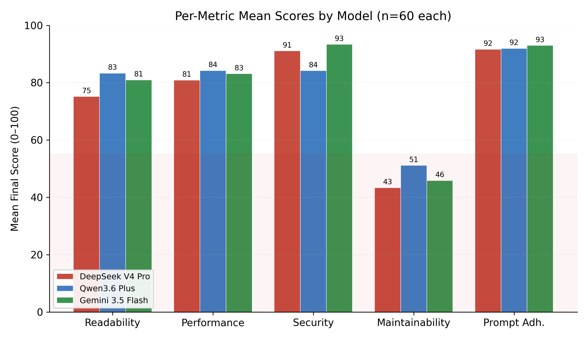
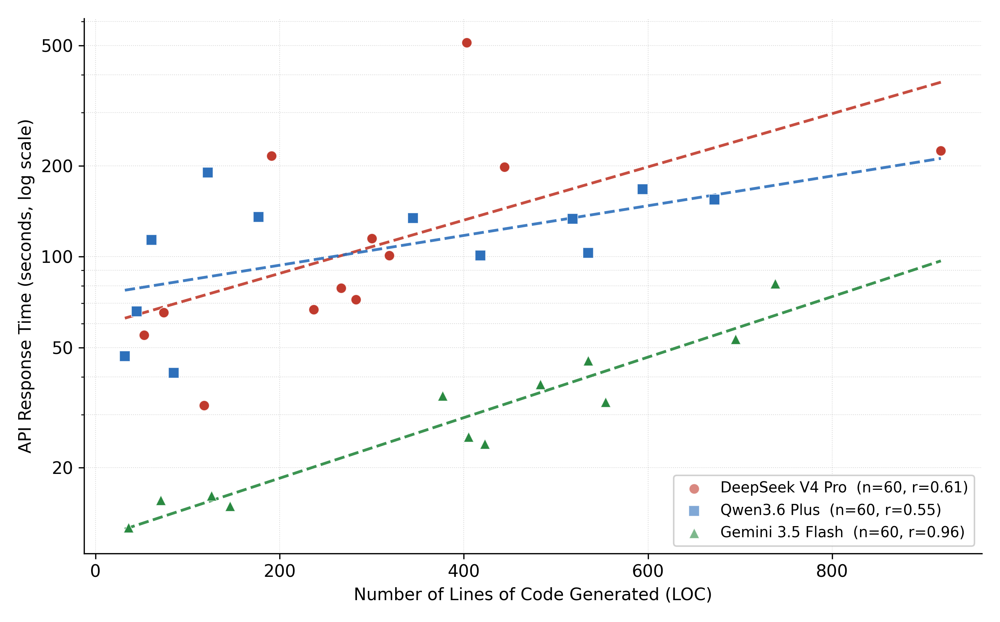
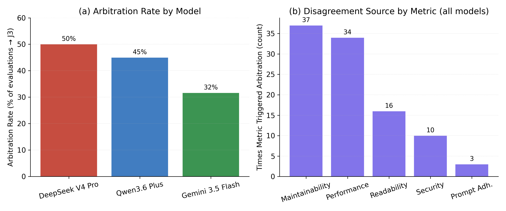
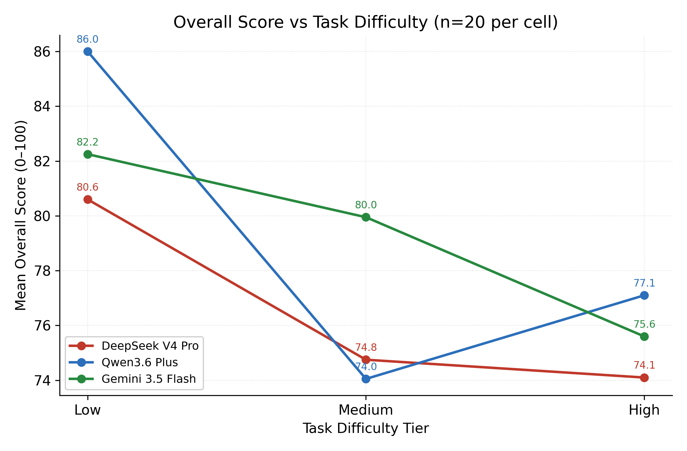

# Loomina Benchmark — Empirical Results & Findings

> **Purpose.** This document is the paper-ready *Results & Findings* supplement for the Loomina
> multi-LLM UI code-generation benchmark. It reports the **real, aggregated quantitative results** of
> the full experiment so they can be lifted directly into the paper's Results and Discussion sections.
> The *methodology* (judge architecture, rubrics, arbitration logic, inference parameters) is specified
> separately in [`hakem-sistemi-metodoloji.md`](hakem-sistemi-metodoloji.md); this document does not
> repeat it and only references it where needed.
>
> **All numbers below are computed directly from the raw test reports** in
> [`docs/Testler/`](Testler/) by the read-only scripts
> [`generate_fig8.py`](Testler/generate_fig8.py) and
> [`generate_results_figs.py`](Testler/generate_results_figs.py). Coverage: **180 / 180 evaluations,
> 0 missing.**

---

## 1. Experimental Setup (summary)

We benchmark three code-generating LLMs on a fixed prompt suite and score every output with the
dual-judge + dynamic-arbitration pipeline described in the methodology document.

| Item | Value |
|---|---|
| Generator models | DeepSeek V4 Pro (`deepseek/deepseek-v4-pro`), Qwen3.6 Plus (`qwen/qwen3.6-plus`), Gemini 3.5 Flash (`google/gemini-3.5-flash`) |
| Prompt suite | **4 themes × 3 difficulty tiers = 12 tasks**, each repeated **5 times** |
| Runs per model | 12 × 5 = **60** |
| Total evaluations | 60 × 3 = **180** |
| Judges | J1 = `deepseek/deepseek-v4-pro`, J2 = `minimax/minimax-m3`, J3 = `x-ai/grok-4.3` (arbitrator) |
| Metrics | Readability, Performance, Security, Maintainability, Prompt Adherence (0–100) |
| Disagreement threshold | \|J1 − J2\| > 20 → arbitration (J3); final = median(J1, J2, J3) on disagreed metrics |
| Inference params | Generation `T=0.7`; Judges/Arbitrator `T=0.1` (see methodology §7) |

**Themes** (each instantiated at three difficulty levels):

| # | Theme | Low (.1) | Medium (.2) | High (.3) |
|---|---|---|---|---|
| 1 | Online Education | Course card component | Course video player layout | Student dashboard |
| 2 | Restaurant POS | Menu item button | Split-screen ordering screen | Table floor-plan manager |
| 3 | Project Management (Kanban) | Task ticket component | Drag-and-drop Kanban board | Sprint performance dashboard |
| 4 | AI Tools | Voice-recording indicator | Local AI chat interface | AI developer workspace (3-pane) |

**Difficulty tiers** reflect output scope: **Low** = single isolated component; **Medium** = a
multi-region responsive layout; **High** = a full, stateful React application.

---

## 2. Measurement

- **Score (0–100).** Each metric's **final** score is taken *after* arbitration (consensus average
  where J1/J2 agree; `median(J1,J2,J3)` where they disagree). The per-task **Overall** score is the
  mean of the five final metric scores.
- **Latency (s).** The generation API call duration ("Üretim Süresi") reported for each output,
  converted from milliseconds to seconds. This is the wall-clock time to produce the code.
- **LOC.** Non-blank lines of the generated code block (standard LOC), extracted between the
  `## Üretilen Kod` and `## Hakem Skor` headers to be robust against code that itself embeds
  Markdown fences.

Raw per-output records (model, LOC, latency, theme, difficulty, repetition) are exported to
[`Testler/fig8-data.csv`](Testler/fig8-data.csv) (180 rows).

---

## 3. Overall Model Performance

| Model | Overall mean | SD | Median | Min | Max | Latency mean | Latency median | LOC mean |
|---|---:|---:|---:|---:|---:|---:|---:|---:|
| DeepSeek V4 Pro | 76.5 | 10.1 | 79 | 45 | 92 | 144.6 s | 89.8 s | 301 |
| Qwen3.6 Plus | 79.0 | 8.1 | 80 | 59 | 91 | 115.5 s | 123.5 s | 300 |
| Gemini 3.5 Flash | 79.3 | 3.6 | 80 | 69 | 86 | 32.8 s | 29.1 s | 382 |

**Findings.**
- **The three models are close on mean quality (76.5–79.3)** — there is no large overall quality gap.
- **Gemini 3.5 Flash is by far the most *consistent*** (SD = 3.6 vs 8.1 and 10.1) **and the fastest**
  (≈4–5× lower latency), while producing the *most* code on average. Consistency, not peak score,
  is its differentiator.
- **DeepSeek V4 Pro is the most *variable*** (SD = 10.1, range 45–92) **and the slowest** — consistent
  with it being a reasoning model that spends part of its budget on internal deliberation.
- Mean overall differences between models are small relative to their spread; **per-metric and
  per-difficulty breakdowns (below) are more informative than the headline average.**

---

## 4. Per-Metric Results

| Model | Readability | Performance | Security | **Maintainability** | Prompt Adherence |
|---|---:|---:|---:|---:|---:|
| DeepSeek V4 Pro | 75.2 | 80.9 | 91.1 | **43.4** | 91.7 |
| Qwen3.6 Plus | 83.3 | 84.2 | 84.2 | **51.1** | 92.0 |
| Gemini 3.5 Flash | 81.0 | 83.1 | 93.4 | **45.9** | 93.0 |

**Findings.**
- **Prompt Adherence is uniformly high (91.7–93.0).** All models reliably satisfy explicit,
  verifiable instructions (required elements, framework/styling constraints, "code-only" output).
- **Security is high (84–93)**, led by Gemini (93.4) and DeepSeek (91.1) — though note the static
  nature of this metric (methodology §12).
- **Readability / Performance sit in the high-70s to mid-80s**, with Qwen leading Readability (83.3).
- **Maintainability collapses for every model (43.4–51.1)** — a 30–45 point gap below all other
  metrics. See §5.

---

## 5. Key Finding — Maintainability Is a Systematic Weakness

Across **all three models** and **all 12 tasks**, Maintainability is the single worst metric by a
large margin (43–51 vs 75–93 elsewhere). This is **not model-specific noise**; it is a *structural*
property of one-shot LLM UI generation:

- Outputs are typically **single-file, monolithic** components — no separation into reusable
  sub-components, no externalised data/props, hard-coded ("magic") values inline.
- The judges' own improvement suggestions converge on the same theme: *"extract reusable
  sub-components,"* *"lift content into props/data,"* *"move style tokens to a theme config."*

**Paper relevance.** This is one of the strongest, most defensible findings: contemporary LLMs
produce code that **looks good and runs (high readability/security/adherence) but does not scale
maintainably**. It directly motivates the value of a maintainability-aware evaluation dimension and
is a clean target for future work (e.g., multi-file / component-decomposition prompting).

---

## 6. Generation Latency vs Output Size (Fig. 8)

Linear regression of `log10(latency)` on LOC (drawn straight on the log axis):

| Model | LOC range | Latency range | Pearson r (LOC ↔ log-latency) |
|---|---|---|---:|
| Gemini 3.5 Flash | 36–738 | 12.7–81.5 s | **0.96** |
| DeepSeek V4 Pro | 53–918 | 32.2–511.1 s | 0.61 |
| Qwen3.6 Plus | 32–672 | 41.2–190.0 s | 0.55 |

**Findings.**
- **Gemini's latency is almost perfectly predicted by output size (r = 0.96)** — it behaves like a
  straightforward decoder: time ∝ tokens. This predictability is attractive for production use.
- **DeepSeek and Qwen show weaker LOC↔latency coupling (r = 0.61 / 0.55).** For DeepSeek this is
  expected: as a reasoning model it spends variable, output-independent time on internal reasoning,
  yielding latency up to **511 s** that LOC alone cannot explain.
- A **log latency axis** is necessary because latency spans ~12 s to ~511 s; on a linear axis the
  fast cluster would be unreadable.

---

## 7. Arbitration & Judge Disagreement

**Overall arbitration rate: 42 %** (76 of 180 evaluations triggered J3).

| Model | Consensus | Arbitration (J3) | Arbitration rate |
|---|---:|---:|---:|
| DeepSeek V4 Pro | 30 | 30 | **50 %** |
| Qwen3.6 Plus | 33 | 27 | 45 % |
| Gemini 3.5 Flash | 41 | 19 | **32 %** |

**Which metric drives disagreement** (number of times each metric exceeded the threshold and
triggered J3, across all models) and the mean \|J1 − J2\| gap per metric:

| Metric | J3 triggers | Mean \|J1−J2\| | Share of metric-pairs with gap > 20 |
|---|---:|---:|---:|
| Maintainability | 37 | 13.1 | 21 % |
| Performance | 34 | 13.9 | 19 % |
| Readability | 16 | 9.8 | 9 % |
| Security | 10 | 8.2 | 6 % |
| Prompt Adherence | 3 | 2.7 | 2 % |

**Findings.**
- **Disagreement is concentrated in the subjective / architectural metrics** (Maintainability,
  Performance), while **objective, verifiable metrics (Prompt Adherence, Security) are highly stable**
  between judges. This is exactly the expected and desirable behaviour of an LLM-as-judge panel: the
  judges agree on checkable facts and diverge on judgement calls — which is precisely where the
  arbitrator adds value.
- **Lower model consistency correlates with more arbitration:** the most variable generator
  (DeepSeek, SD 10.1) triggers arbitration most often (50 %), the most consistent (Gemini, SD 3.6)
  least often (32 %).
- **The 42 % overall arbitration rate is high** and should be reported transparently. The methodology
  flags that a rate above ~30 % warrants revisiting the disagreement threshold (currently 20). This
  is a calibration discussion point, *not* a correctness defect — the median tie-breaker keeps a
  single outlier judge from dominating (methodology §6.3). Reporting it honestly strengthens the
  paper; a sensitivity analysis over thresholds {15, 18, 20, 22, 25} is a natural next step.

---

## 8. Difficulty Scaling

| Model | Low | Medium | High |
|---|---:|---:|---:|
| DeepSeek V4 Pro | 80.6 | 74.8 | 74.1 |
| Qwen3.6 Plus | 86.0 | 74.0 | 77.1 |
| Gemini 3.5 Flash | 82.2 | 80.0 | 75.6 |

**Findings.**
- **The Low tier is clearly the easiest for every model** (80.6–86.0), and **all models score lower
  once difficulty increases** — evidence that the difficulty tiers are meaningful and that quality
  degrades as required scope grows.
- The decline is **not strictly monotonic** for every model (e.g., Qwen dips at Medium then partially
  recovers at High), so we report it as *"Low ≫ Medium/High"* rather than a clean linear trend.
- **Gemini degrades most gracefully** (82.2 → 75.6, a 6.6-point drop) — its consistency advantage
  holds even as tasks get harder.

---

## 9. Theme Breakdown

Mean Overall score per theme (n = 15 per cell):

| Model | T1 Education | T2 Restaurant POS | T3 Kanban/PM | T4 AI Tools |
|---|---:|---:|---:|---:|
| DeepSeek V4 Pro | 77.6 | 75.1 | 79.5 | 73.8 |
| Qwen3.6 Plus | 79.3 | 83.7 | 77.0 | 76.1 |
| Gemini 3.5 Flash | 79.1 | 79.7 | 79.5 | 78.7 |

**Findings.**
- **Gemini is remarkably theme-invariant** (78.7–79.7, ~1-point spread) — it does not have obvious
  domain blind spots.
- **Qwen is the most theme-sensitive**, peaking on Restaurant POS (83.7) and dipping on AI Tools
  (76.1). **AI Tools (Theme 4) is the hardest theme on average for two of three models**, consistent
  with it containing the most complex stateful layouts (e.g., the 3-pane AI developer workspace).

---

## 10. Key Findings — Must Mention in the Paper

1. **Three frontier models cluster tightly on mean quality (76.5–79.3)** — differentiation comes from
   *consistency, latency, and per-metric profile*, not headline average.
2. **Maintainability is a universal, structural weakness (43–51)** — the clearest cross-model result;
   one-shot LLM UI code is readable and functional but not maintainably structured.
3. **Gemini 3.5 Flash = best consistency + lowest latency + most predictable latency (r=0.96)** — the
   strongest "production-fit" profile despite not topping every metric.
4. **DeepSeek V4 Pro (reasoning) is slowest and most variable** — up to 511 s latency that output size
   does not explain (r=0.61).
5. **Prompt Adherence and Security are stable and high; judges rarely disagree on them.** The panel
   agrees on verifiable facts.
6. **Arbitration is concentrated on subjective metrics** (Maintainability/Performance trigger 71 of
   100 metric-level disagreements) — validating *why* a dynamic arbitrator is needed.
7. **Overall 42 % arbitration rate** — report transparently; motivates threshold-sensitivity analysis.
8. **Difficulty tiers are valid**: the Low tier is easiest for all models; quality drops as scope grows,
   with Gemini degrading most gracefully.
9. **Latency must use a log axis** (12 s–511 s span) — a methodological note for the figure.

---

## 11. Threats to Validity

In addition to the design-level limitations in methodology §12 (static analysis, anchoring,
producer–judge family overlap, reasoning-model latency, prompt-adherence blending asymmetry,
preview ≠ evaluation), the empirical study has the following threats:

- **Sample size.** n = 60 per model (12 tasks × 5 repetitions). Adequate for stable means but small
  for per-cell (theme × difficulty) inference; treat cell-level numbers as indicative.
- **Single evaluation pass.** Each output was scored once by the panel; judge stochasticity is not
  averaged out across repeated scorings (only across the 5 generation repetitions).
- **High arbitration rate (42 %).** Indicates the J1/J2 pair disagrees often on subjective metrics;
  the threshold (20) may warrant recalibration (sensitivity analysis recommended).
- **Static, non-executed evaluation.** Performance and Security are judged from code text, not runtime
  behaviour — a known ceiling on those metrics' discriminative power.
- **Provider-family overlap.** DeepSeek appears both as a generator and as judge J1; although no
  self-preference was observed (DeepSeek ranks *lowest* on mean overall, not highest), a blinded /
  anonymised judging layer is future work.
- **No human-rater baseline yet.** Inter-rater agreement against human experts (e.g., Krippendorff's α)
  and rubric validation are not yet measured — recommended as the primary future-work extension.

---

## 12. Reproducibility

- **Data source.** [`docs/Testler/`](Testler/) — 60 Markdown reports, 3 model sections each.
- **Extraction + figures.** [`Testler/generate_fig8.py`](Testler/generate_fig8.py) (Fig. 8 + CSV) and
  [`Testler/generate_results_figs.py`](Testler/generate_results_figs.py) (per-metric, arbitration,
  difficulty figures). Both are deterministic, read-only, and print the summary statistics they plot.
- **Run:** `python docs/Testler/generate_fig8.py && python docs/Testler/generate_results_figs.py`
  (requires `numpy`, `matplotlib`). Console output reports `n=60` per model and `MISS=0`.
- **Raw table.** [`Testler/fig8-data.csv`](Testler/fig8-data.csv) (180 rows).
- **Code/version.** Record the Git commit/branch used for the benchmark run in the paper's
  reproducibility statement. Inference parameters are centralised in `src/lib/llmConfig.ts`
  (methodology §7).

---

## 13. Appendix — Figure & Table Inventory

| Asset | Source script | Shows |
|---|---|---|
| `Testler/fig8-loc-vs-latency.{png,svg}` | `generate_fig8.py` | LOC vs latency scatter + per-model log-linear trend, with Pearson r |
| `Testler/fig-metric-bars.{png,svg}` | `generate_results_figs.py` | Per-metric mean scores by model (grouped bars) |
| `Testler/fig-arbitration.{png,svg}` | `generate_results_figs.py` | (a) arbitration rate by model; (b) disagreement source by metric |
| `Testler/fig-difficulty.{png,svg}` | `generate_results_figs.py` | Overall score vs difficulty tier, per model |
| `Testler/fig8-data.csv` | `generate_fig8.py` | Raw per-output records (model, loc, seconds, theme, difficulty, test) |

All figures are emitted as **300-dpi PNG** (drafts/preview) and **SVG** (vector, publication). Axis
labels are in English to match the paper. Model colour coding is consistent across all figures
(DeepSeek = red, Qwen = blue, Gemini = green).
